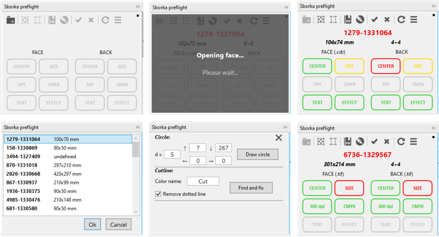

# Sborka preflight 2019
##### (C#, WPF, CorelDraw plug-in)

### Sborka preflight 2019 is a CorelDraw plug-in for internal use at the print shop Sborka.ua that checks design layouts against the print shop technical requirements and helps prepare them for printing.

Provides the tools to:
- output designs provided by the customer (raster images, one-page or two-page .cdr-file, one-page .cdr-file containing 2 layouts on one page) to print-ready documents (.cdr or .pdf);
- check customer-provided raster layouts for compliance with size, resolution and color model;
- сheck vector layouts for proper size, absence of text objects or effects;
- add and correct templates for the plotter cutting.

#### The result of processing a file containing two layouts on one page

#### The result of processing a layout consisting of 2 files
